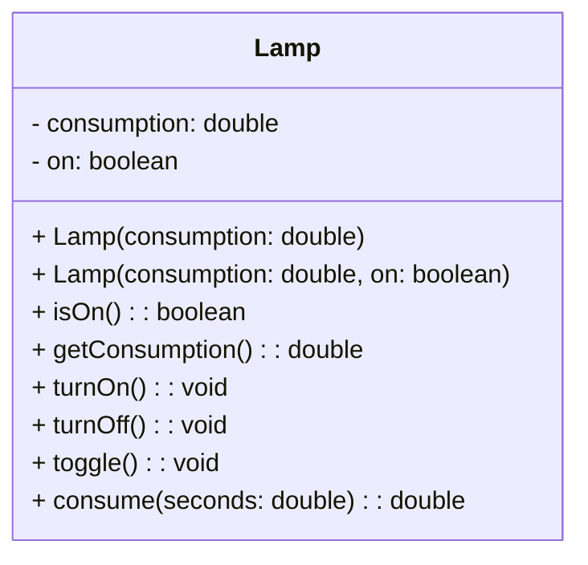

## Exam
La contrasenya és `1234`.

---

/// html | div#protected
## Contingut
Aquest contingut està protegit per contrasenya.

### Hola
### Exercici 1

$$
kW = kWh \cdot \frac{seconds}{3600}
$$
///
