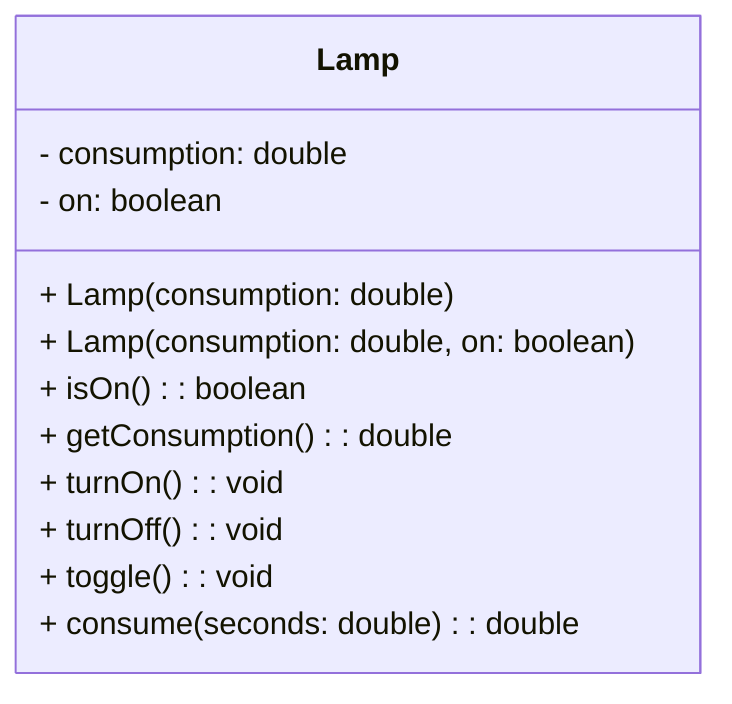

# Examen

Plantilla per a exàmens amb contingut protegit per contrasenya. Utilitza la plantilla `exam.html` i defineix el contingut protegit dins d'un bloc amb l'`inject_id` configurat al front matter.

La contrasenya d'aquest exemple és `1234`.

---

/// html | div#protected
## Contingut
Aquest contingut està protegit per contrasenya.

### Hola
### Exercici 1

$$
kW = kWh \cdot \frac{seconds}{3600}
$$
///
